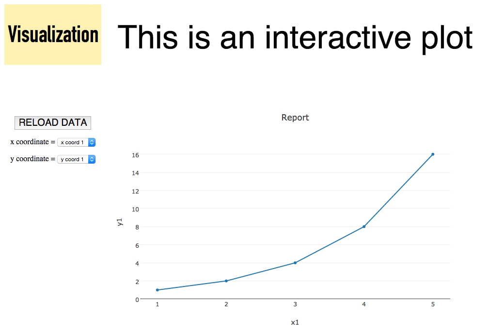

Plotly_Visualization
====================

This is a simple visualization template with a scatter plot of a dataset that can be loaded from outside the page.

The data is stored as a json file and has the following contents for the purpose of the template:

```json
[
  {
   "x1":[1,2,3,4,5],
   "y1":[1,2,4,8,16],
   "x2":[10,20,30,40,50],
   "y2":[5,7,4,2,1],
   "x3":[100,200,300,400,500],
   "y3":[10,12,25,8,18]
  }
]
```

A couple of popups are used to select which array to represent as *x coordinate* and which one as *y coordinate*.

The template is using the open source libraries [plotly.js](https://plot.ly/javascript/) and [d3.js](http://d3js.org/).

Here is a screen shot of how it looks like:



Enjoy!

Jesús Martínez-Blanco
